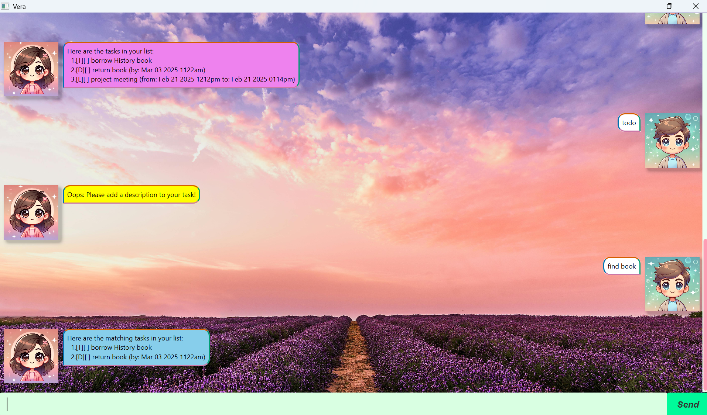

# Vera User Guide


Vera is a text-based chatbot that helps you manage tasks effortlessly. It supports adding, deleting, marking, unmarking, and searching for tasks while ensuring persistent storage.

## Features
### 1. List all tasks
Displays the current list of tasks.

**Command:**
`list`

**Expected Output:**
```
Here are the tasks in your list:
  1.[T][ ] read book
  2.[D][ ] return book (by: Feb 01 2025 1159pm)
  3.[E][ ] project meeting (from: Jan 29 2025 0400pm to: Jan 29 2025 0600pm)
  4.[T][ ] join sports club
  5.[T][ ] borrow book
```  
Symbol for each task:  
todo task: [T] , deadline task: [D], event task: [E]

### 2. Add a todo task
Adds a Todo task to the list.  
**Command:**   
format: `todo` + `description`
Eg. `todo read book`

**Expected Output:**
```
Got it. I've added this task:
   [T][ ] read book
Now you have 1 tasks in the list.
```

### 3. Add a Deadline task
Adds a Deadline task to the list.  
**Command:**  
format: `deadline` + `description` + `/by` + `YYYY-MM-DD HHmm`  
Eg. `deadline return book /by 2025-02-01 1159`  

**Expected Output:**
```
Got it. I've added this task:
   [D][ ] return book (by: Feb 01 2025 1159pm)
Now you have 2 tasks in the list.
```

### 4. Add a Event task
Adds an Event task to the list.  
**Command:**  
format: `event` + `description` + `/from` + `YYYY-MM-DD HHmm` + `/by` + `YYYY-MM-DD HHmm`  
Eg. `event project meeting /from 2025-01-29 1600/to 2025-01-29 1800`

**Expected Output:**
```
Got it. I've added this task:
  [E][ ] project meeting (from: Jan 29 2025 0400pm to: Jan 29 2025 0600pm)
Now you have 3 tasks in the list.
```

### 5. Mark / Unmark task
Marks a specified task as completed or not completed.  
**Command:**  
format: `mark` + `index` or `unmark` + `index`  
Eg. `mark 1`, `unmark 2`  

Task marked will be shown with [X] in the list.
Eg. `list`  

**Expected Output:**  
```
Here are the tasks in your list:
  1.[T][X] read book
  2.[D][ ] return book (by: Feb 01 2025 1159pm)  
```

### 6. Delete task
Removes a task from the list.  
**Command:**  
format: `delete` + `index`  
Eg. `delete 1`  

### 7. Find task
Searches for tasks that match a **keyword**.  

**Command:**  
format: `find` + `keyword`  
Eg. `find book`

**Expected Output:**  
```
Here are the matching tasks in your list:
1. [T][ ] read book
2. [D][ ] return book (by: Feb 01 2025 1159pm)  
```

### 8. Snooze task
Postpones a **Deadline** or reschedules an **Event**.  

**Command:**  
To snooze deadline task: `snooze` + `index` + `YYYY-MM-DD HHmm`  
To snooze event task: `snooze` + `index` + `YYYY-MM-DD HHmm` + `YYYY-MM-DD HHmm`  

Eg. `snooze 2 2025-02-03 1122`, `snooze 3 2025-04-13 1000 2025-04-13 1700`

**Expected Output:**   
```
Event task rescheduled to: from Apr 13 2025 1000 to Apr 13 2025 1700
```

### 9. Close window
**Command:**
`bye`

## Additional Information
- Vera automatically **saves your tasks** after each command.
- Tasks are loaded from the saved file when Vera starts.
- Dates and times should be provided in **YYYY-MM-DD HHMM** format.
